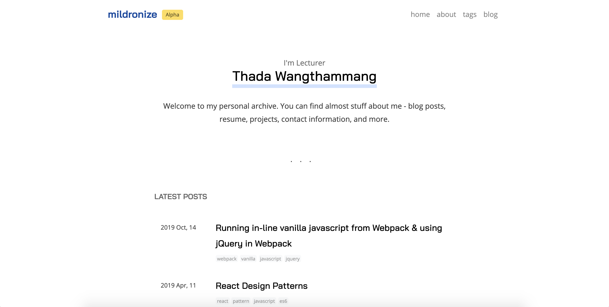

# Mildronize.com

using `11ty` tools + [Deventy](https://github.com/ianrose/deventy)

# Deventy + mildronize

A minimal 11ty starting point for building static websites with modern tools. Uses the CLI of each tool. Allowing a much easier upgrade path for each individual development tool.



Features:
- [11ty](https://www.11ty.io/)
- [Sass/SCSS](https://github.com/sass/node-sass)
- [Webpack](https://webpack.js.org/)
- [Babel](https://babeljs.io/)
- [light-server](https://github.com/txchen/light-server)
- [PostCSS](https://postcss.org/)
- [CSSnano](https://cssnano.co/)
- [Autoprefixer](https://github.com/postcss/autoprefixer)

Added Feature:
- Reorganize file structure (put files that it's not relate with content in `template` folder)
- Viewer count on each post
- [Netlify CMS](https://www.netlifycms.org/)
- Blog with `tag` and `page`
- [FancyBox](https://www.fancyapps.com/fancybox/3/) on `post` layout
- Burry Load image when image is loading

## File Structure

```
.  
├── _11ty                        # Store script for 11ty
│   └── getTagList.js    
└── src                              
    ├── _data                    # Store data
    │   ├── metadata.json        # Author data
    │   └── site.json            # Site data
    ├── _template                # Template Files
    │   ├── _includes            # Include files
    │   │   ├── components       # Component files 
    │   │   └── layouts          # Layout files 
    │   ├── assets               # Static files used by the template
    │   ├── feed                 # feed.xml
    │   ├── scripts
    │   │   └── index.js
    │   └── styles               # SCSS files
    │       ├── _styles.scss     # The template styles
    │       ├── components       # The component styles
    │       ├── index.scss       # Main scss file
    │       └── layouts          # The component styles
    ├── admin                    # Netlify CMS
    ├── pages                    # store `Page`
    ├── posts                    # store `Post`
    ├── static                   # store static file for content `Post` and `Page`
    ├── archive.njk
    ├── index.njk
    ├── tags-list.njk
    └── tags.njk
```

## Getting Started

Install all dependencies using npm:

```
$ nvm use
$ npm install
```

### To Develop

```
$ npm run dev
```
 And in debug mode:
 
```
$ npm run dev:debug
```

You can view the website at the given access URL:
```
$ light-server is listening at http://localhost:4000
```

The local url is configured in `.lightserverrc`

### To Build

```
npm run build
```
